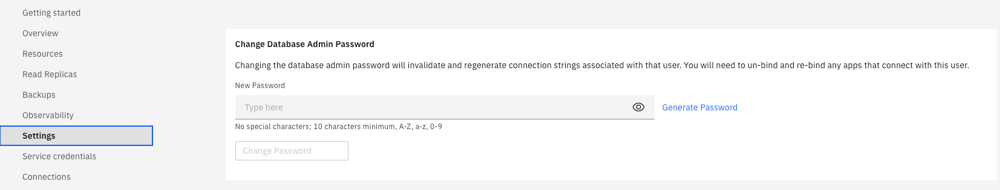

---
copyright:
  years: 2021
lastupdated: "2021-12-01"

keywords: mysql, databases

subcollection: databases-for-mysql

---

{:external: .external target="_blank"}
{:shortdesc: .shortdesc}
{:screen: .screen}
{:codeblock: .codeblock}
{:pre: .pre}
{:tip: .tip}

# Setting the Admin Password
{: #admin-password}

The {{site.data.keyword.databases-for-mysql_full}} service is provisioned with an admin user, so you can manage MySQL by using its command line tool, `mysql`.

You have to set the admin password before you can use it to connect. To set the password through the {{site.data.keyword.cloud_notm}} dashboard, select _Manage_ from the service dashboard to open the management panel for your service. Open the _Settings_ tab, and use the _Change Database Admin Password_ pane to set a new admin password.

{: caption="Figure 1. The Change Database Admin Password pane in Settings" caption-side="bottom"}

## Setting the admin password via the command line
{: #admin-password-cli}

Use the `cdb user-password` command from the {{site.data.keyword.cloud_notm}} CLI cloud databases plug-in to set the admin password with the command line.

For example, to set the admin password for a deployment named "example-deployment", use the following command.
```shell
ibmcloud cdb user-password example-deployment admin <newpassword>
```
{: pre}

## Setting the admin password via the API
{: #admin-password-api}

The _Foundation Endpoint_ that is shown on the _Overview_ panel _Deployment Details_ section of your service provides the base URL to access this deployment through the API. Use it with the `/deployments/{id}/users/{username}` endpoint to set the admin password.
```shell
curl -X PATCH `https://api.{region}.databases.cloud.ibm.com/v4/ibm/deployments/{id}/users/admin' \
-H "Authorization: Bearer $APIKEY" \
-H "Content-Type: application/json" \
-d '{"password":"newrootpasswordsupersecure21"}'
```
{: pre}

For more information, see the [API Reference](https://{DomainName}/apidocs/cloud-databases-api#set-database-level-user-s-password).
