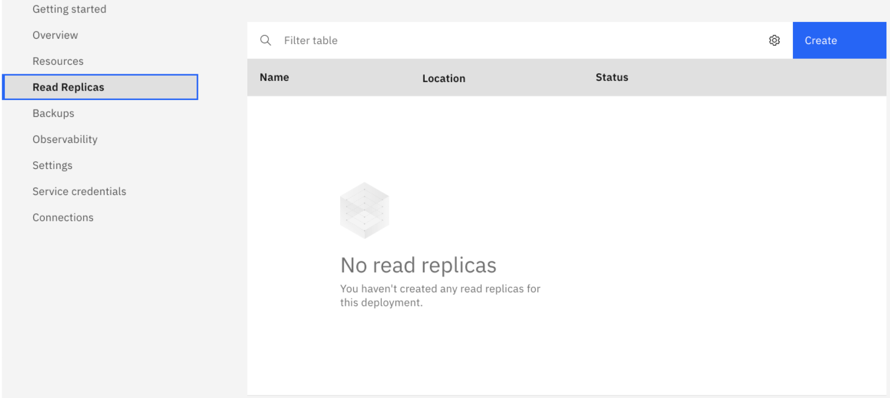
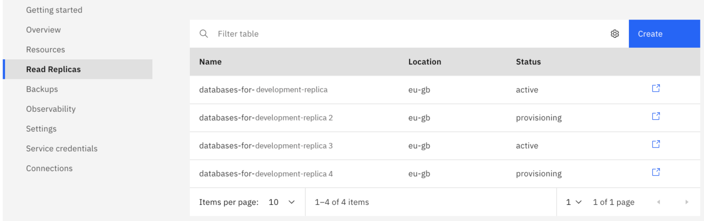
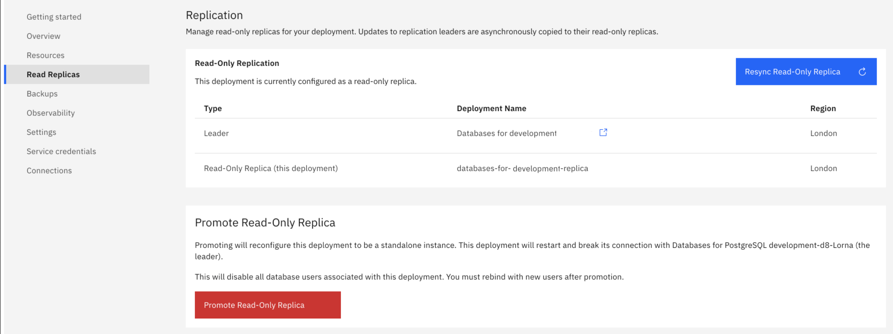

---

copyright:
  years: 2021, 2024
lastupdated: "2024-08-15"

keywords: mysql, databases, read replica, resync, promote, cross-region replication, mysql read replica, mysql replication

subcollection: databases-for-mysql

---

{{site.data.keyword.attribute-definition-list}}

# Configuring read replicas
{: #read-replicas}

You can set up your {{site.data.keyword.databases-for-mysql_full}} deployment to be a read replica of another {{site.data.keyword.databases-for-mysql}} deployment. 

A read replica is set up to replicate all your data from the source instance to the replica deployment using asynchronous replication. As the name implies, read replicas support read transactions, and can be used to balance databases that have both write-heavy and read-heavy operations. You can also use read replica promotion for data recovery if the source database instance fails. The read replica has a single MySQL data member, and it is billed at the [same per member consumption rates as the source database instance](https://{DomainName}/catalog/services/databases-for-mysql/).

## Read replica Considerations
{: #read-replicas-consider}

- A read replica can exist in the same region as your source database instance or in a different one, enabling your data to be replicated across regions.

- A read replica must be the same major version as its source database instance. 

- Backups are disabled on read replicas. Backups are taken only on source database instances.

- Read replication is not supported into or out of EU Cloud-enabled regions (currently `eu-de`). It is supported within those regions.

- There is a limit of five read replicas per source instance.

- The read replica does not participate in elections for the source database instance and failover to the read replica is not automated. Promotion of the read replica to a full deployment is a manual, user-initiated task.

- The minimum size of a read replica is 2 GB RAM and 20 GB of disk. This is true even if your source database instance deployment is smaller.

- Read replicas do not auto-scale to match the source database instance. If the amount of data you store outgrows the disk that is allocated to your deployments, scale the disk on the read replicas and then the source database instance. Scaling the read replica first ensures that you do not run out of space on the read replicas. If you scaled the source database instance's disk for performance and not for space, it is not necessary to scale the read replicas.

- Replication is asynchronous, and might be subject to replication lag. By default, there is no communication between the primary and replica regarding consistency. It is possible for a read replica to fall far enough behind that it needs to be resynced. Replication lag can be greater when the replica is in a region far away geographically from its source database instance.

- A read replica is a deployment with single data member and does not have any internal high-availability. It is prone to temporary interruptions and downtime during maintenance. If you have applications that rely on read replicas, be sure to have logic to retry failed queries, or load-balancing over multiple read replicas.

- **{{site.data.keyword.databases-for-mysql}} read replicas in Madrid (`eu-es`): The deployment of read replicas in Madrid in the `eu-es` region is currently suspended. Updates on availability will be provided as soon as possible.**

## The Leader
{: #read-replicas-leader}

On the _Read Replicas_ tab of a {{site.data.keyword.databases-for-mysql}} deployment before any read replicas are provisioned, the center pane notes that no read replicas exist and provides a **Create** button.

{: caption="Replication pane before a replica" caption-side="bottom"}

If a deployment is a leader and has a read replica that is already attached to it, then the _Replication_ pane has a list of replica deployments and a link to each one.

{: caption="List of replicas that are attached to a leader" caption-side="bottom"}

## Provisioning a Read Replica
{: #read-replicas-provisioning}

You can provision a read replica from the leader's _Read Replicas_ tab by clicking **Create Read Replica**. The source instance is automatically filled in. The read replica's name is auto-generated in the _Service Name_ field, but you can rename it freely. You can choose the region to deploy it in, and its initial memory allocation. Disk size, version, and public or private endpoints are automatically configured to match the settings of the source database instance deployment.

If you use [Key Protect](/docs/databases-for-mysql?topic=cloud-databases-key-protect), Bring Your Own Key (BYOK) is supported only when provisioning from the CLI and API. Otherwise, the read replica is encrypted with a generated key.
{: .tip}

### Provisioning through the API or the CLI
{: #read-replicas-provisioning-api-cli}

Provisioning a read replica through the CLI and the API works similarly to [provisioning a standard {{site.data.keyword.databases-for-mysql}} deployment](/docs/cloud-databases?topic=cloud-databases-provisioning). Provisioning is handled by the Resource Controller, and it uses a parameter `{"remote_leader_id": "crn:v1:..."}` to specify the leader of the replica you are provisioning.

For example, to provision a read replica through the CLI,

```sh
ibmcloud resource service-instance-create <replica_name> databases-for-mysql standard <region> \
-p \ '{
  "remote_leader_id": "crn:v1:bluemix:public:databases-for-mysql:us-south:a/54e8ffe85dcedf470db5b5ee6ac4a8d8:1b8f53db-fc2d-4e24-8470-f82b15c71819::",
  "members_memory_allocation_mb": "2048",
  "members_disk_allocation_mb": "10240"
}'
```
{: pre}

The same parameter is used to provision a read replica through the Resource Controller API.

```sh
curl -X POST \
  https://resource-controller.cloud.ibm.com/v2/resource_instances \
  -H 'Authorization: Bearer <>' \
  -H 'Content-Type: application/json' \
    -d '{
    "name": "<replica_name>",
    "target": "<region>",
    "resource_group": "<your_resource_group_id>",
    "resource_plan_id": "databases-for-mysql-standard",
    "remote_leader_id": "crn:v1:bluemix:public:databases-for-mysql:us-south:a/54e8ffe85dcedf470db5b5ee6ac4a8d8:1b8f53db-fc2d-4e24-8470-f82b15c71819::",
    "members_memory_allocation_mb": "2048",
    "members_disk_allocation_mb": "10240"
  }'
```
{: pre}

For both the CLI and API commands, you must specify both the RAM and disk amounts, keeping in mind the minimum size is 2 GB RAM and 20 GB disk. You can optionally specify whether the read replica uses public or private endpoints. You are not able to specify a version for the read replica. The version is automatically set to the same major version as the source database instance deployment.

## The Read Replica
{: #read-replica}

On the _Read Replicas_ tab of a read replica, the _Replication_ pane contains its name and region, and the name and region of its source database instance. It also has buttons to resync the read replica and to promote it.

{: caption="Replication pane of a read replica" caption-side="bottom"}

### Checking Replication Status
{: #read-replica-check-replication-status}

Replication status is not automatically monitored, you must monitor replication.

You can check the replication status, as well as the replication lag, of a read replica with `mysql` from its source database instance. [Connect to the source database instance deployment with `mysql`](/docs/databases-for-mysql?topic=databases-for-mysql-connecting-mysql) using the [admin credentials](/docs/databases-for-mysql?topic=databases-for-mysql-user-management#the-admin-user). Once you are connected, run the following command:

```sh
mysql> SHOW SLAVE STATUS \G
```

A key field from the command's status report will be `Seconds_Behind_Master: _`. This is the number of seconds that the replication SQL thread is behind processing the source's binary log.

For more information, see MySQL's [Checking Replication Status](https://dev.mysql.com/doc/refman/5.7/en/replication-administration-status.html).
{: .tip}

### Read Replica Users and Privileges
{: #read-replica-users-privileges}

- Any user on the source database instance, even ones present before read replica provision, can log in to and run reads on a read replica with the same privileges to objects that they have on the source database instance.

- If you have more than one read replica that is attached to a source database instance, a user that is created on the source is also created on all of the other read replicas.

- Users that are created on the source database instance persist on the read replica when it is promoted to a stand-alone deployment, including the `admin` user. When the read replica is promoted, the users and privileges for all users on the source database instance are transferred to the promoted deployment.

- Write operations on the read replica for all users are not filtered or rejected, but fail at the database level.

- Read replica users who are created on a read replica are able to connect to the source database instance with `SELECT` permission.

## Resyncing a Read Replica
{: #read-replica-resyncing}

If you need to resync a read replica, click the **Resync Read Replica** button. Resyncing is a disruptive operation and performing a resync tears down and rebuilds the data in the read replica. The read replica is not able to perform any other operations or run any queries while a resync is running. Queries are not rerouted to the source database instance, so any connections to the read replica fail until it is finished resyncing.

The amount of time it takes to resync a read replica varies, but the process can be very long running.
{: .tip}

To start a resync through the CLI, use the [`cdb read-replica-resync`](/docs/databases-cli-plugin?topic=databases-cli-plugin-cdb-reference#read-replica-resync) command.

```sh
ibmcloud cdb read-replica-resync <deployment name>
```
{: pre}

To start a resync through the API, send a POST to the [`/deployments/{id}/remotes/resync`](https://cloud.ibm.com/apidocs/cloud-databases-api#resync-read-replica) endpoint.

```sh
curl -X POST \
  https://api.{region}.databases.cloud.ibm.com/v4/ibm/deployments/{id}/remotes/resync \
  -H 'Authorization: Bearer <>' 
```
{: pre}

## Promoting a Read Replica
{: #read-replica-promoting}

A read replica is able to be promoted to an independent cluster that can accept write operations as well as read operations. If something happens to the source database instance, the read replica can be promoted to a stand-alone cluster and start accepting writes from your application.

To promote a read replica from the UI, click the **Promote Read Replica** button.

Upon promotion, the read replica terminates its connection to the source database instance and becomes a stand-alone {{site.data.keyword.databases-for-mysql}} deployment. The deployment can start accepting and running read and write operations, backups are enabled, and it is issued its own admin user. A new data member is added so the deployment becomes a cluster with three data members. This increases the cost as it is billed at the same per member consumption rate, but the deployment has three members instead of one.

When you promote a read replica, you can skip the initial backup that would normally be taken upon promotion. Skipping the initial backup means that your replica becomes available more quickly, but there is no immediate backup available. You can start an on-demand backup once the promotion process is complete.

Once a read replica is promoted to an independent deployment, it is not possible to revert it back to a read replica, or have it rejoin a source database instance.

To promote through the CLI, use the [`cdb read-replica-promote`](/docs/databases-cli-plugin?topic=databases-cli-plugin-cdb-reference#read-replica-promote) command.

```sh
ibmcloud cdb read-replica-promote <deployment name>
```
{: pre}

To promote through the API, send a POST to the [`/deployments/{id}/remotes/promotion`](https://cloud.ibm.com/apidocs/cloud-databases-api#modify-read-replication-on-a-deployment) endpoint.

```sh
curl -X POST \
  https://api.{region}.databases.cloud.ibm.com/v4/ibm/deployments/{id}/remotes/promotion \
  -H 'Authorization: Bearer <>'  \
 -H 'Content-Type: application/json' \
 -d '{"promotion": {}}' \ 
```
{: pre}

To promote and skip the initial backup after the promotion, also set `skip_initial_backup` in the JSON body.

```sh
curl -X POST \
  https://api.{region}.databases.cloud.ibm.com/v4/ibm/deployments/{id}/remotes/promotion \
  -H 'Authorization: Bearer <>'  \
 -H 'Content-Type: application/json' \
 -d '{"promotion": {"skip_initial_backup": true}}' \ 
 ```
 {: pre}

### Time to completion
{: #read-replica-completion}

The promote recipe completes only when the database is highly available. However, read/write availability occurs after about 10 minutes with one major caveat: the database is not highly available until the recipe completes.

The full promotion time of a read-replica is determined by the size of the data in two possible ways:
- Read replicas are single members. When promoted, two additional members are added as replicas. The time this takes depends on the size of the data. As databases grow, the creation can take a substantial amount of time. The promote operation does not complete until the creation of both replicas is complete.
- If you choose to take a backup as part of the promotion, the completion of that backup also needs to finish before the recipe completes. Again, this depends on the size of the database.

Remember, no High-Availability member exists until the promotion recipe completes. Likewise, if you have selected to have an initial backup, no backup exists until the second point completes or a manual backup is created.
