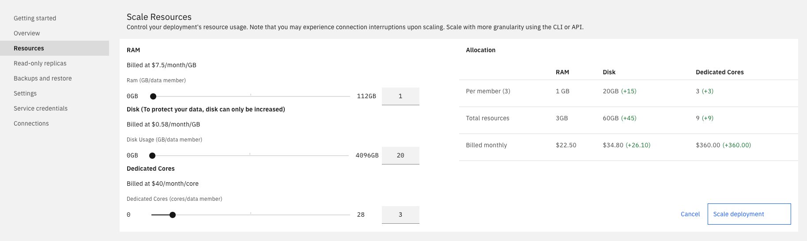

---

copyright:
  years: 2021, 2022
lastupdated: "2022-07-19"

keywords: mysql, databases, scaling, memory, disk IOPS, CPU, mysql dedicated cores, sclaing mysql

subcollection: databases-for-mysql

---

{:external: .external target="_blank"}
{:shortdesc: .shortdesc}
{:screen: .screen}
{:codeblock: .codeblock}
{:pre: .pre}
{:tip: .tip}

# Scaling Disk, RAM, and CPU
{: #resources-scaling}

You can manually adjust the amount of resources available to your {{site.data.keyword.databases-for-mysql_full}} deployment to suit your workload and the size of your data.

## Resource Breakdown
{: #resources-breakdown}

{{site.data.keyword.databases-for-mysql}} deployments have three data members in a cluster, and resources are allocated to members equally. For example, the minimum storage of a MySQL deployment is 20,480 MB, which equates to an initial size of 6,826 MB per member. The minimum RAM for a MySQL deployment is 3072 MB, which equates to an initial allocation of 1024 MB per member.

Billing is based on the _total_ amount of resources that are allocated to the service.
{: .tip}

### Disk
{: #resources-disk}

Your disk allocation must be enough to store all of your data. Your data is replicated to all data members so the total amount of disk that you use is at least three times the size of your data set. 

Disk allocation also affects the performance of the disk, with larger disks having higher performance. Baseline input/output operations per second (IOPS) performance for disk is 10 IOPS for each GB. Scale disk to increase the IOPS that your deployment can handle.

You cannot scale down storage.
{: .tip} 

### RAM
{: #resources-ram}

If you find that your deployment is suffering from performance issues due to a lack of memory, you can scale the amount of RAM allocated to it. Your disk allocation must be sufficient to store all your data, which is replicated to all data members, so the total amount of disk you use is at least three times the size of your data set. The amount of memory allocated to the database's shared buffer pool is not adjusted automatically when you scale your deployment. It's recommended to be set to 25% of the deployment's total memory. 

### Dedicated Cores
{: #resources-cores}

You can enable or increase the CPU allocation to the deployment. With dedicated cores, your resource group is given a single-tenant host with a reserve of CPU shares. Your deployment is then guaranteed the minimum number of CPUs you specify. The default of 0 dedicated cores uses compute resources on shared hosts. Going from a 0 to a >0 CPU count provisions and moves your deployment to new hosts, and your databases are restarted as part of that move. Going from >0 to a 0 CPU count, moves your deployment to a shared host and also restarts your databases as part of the move.

## Scaling Considerations
{: #resources-scaling-consider}

- Scaling your deployment up might cause your databases to restart. If you scale RAM or CPU and your deployment needs to be moved to a host with more capacity, then the databases are restarted as part of the move.

- Scaling down RAM or CPU does not trigger database restarts.

- Disk cannot be scaled down.

- A few scaling operations can be more long running than others. Enabling dedicated cores moves your deployment to its own host and can take longer than just adding more cores. Similarly, drastically increasing CPU, RAM, or Disk can take longer than smaller increases to account for provisioning more underlying hardware resources.

- Scaling operations are logged in [{{site.data.keyword.at_full}}](/docs/databases-for-mysql?topic=cloud-databases-activity-tracker).

- If you find consistent trends in resource usage or would like to set up scaling when certain resource thresholds are reached, check out enabling [autoscaling](/docs/databases-for-mysql?topic=databases-for-mysql-autoscaling-mysql) on your deployment.

## Scaling in the UI
{: #resources-scaling-ui}

A visual representation of your data members and their resource allocation is available on the _Resources_ tab of your deployment's _Manage_ page. 

{: caption="Figure 1. The Scale Resources Panel in Resources" caption-side="bottom"}

Adjust the slider to increase or decrease the resources that are allocated to your service. The slider controls how much memory or disk is allocated per member. The UI shows the total allocated memory or disk for the position of the slider. Click **Scale** to trigger the scaling operations and return to the dashboard overview. 

The UI currently uses a coarser-grained resolution for scaling than the CLI or API commands. Use the API or CLI to scale if the stops on the slider do not meet your size requirements.
{: .tip}

## Scaling in the CLI 
{: #resources-scaling-cli}

[{{site.data.keyword.cloud_notm}} CLI cloud databases plug-in](/docs/databases-cli-plugin?topic=databases-cli-plugin-cdb-reference) supports viewing and scaling the resources on your deployment. To scale any of the available resource groups, use `cdb deployment-groups-set` command. 

For example, the command to view the resource groups for a deployment named "example-deployment" is, 
```sh
ibmcloud cdb deployment-groups example-deployment
```
{: pre}

and produces the following output:
```sh
Group   member
Count   3
|
+   Memory
|   Allocation              3072mb
|   Allocation per member   1024mb
|   Minimum                 1024mb
|   Step Size               256mb
|   Adjustable              true
|
+   CPU
|   Allocation              6
|   Allocation per member   3
|   Minimum                 6
|   Step Size               2
|   Adjustable              true
|
+   Disk
|   Allocation              15360mb
|   Allocation per member   5120mb
|   Minimum                 15360mb
|   Step Size               15360mb
|   Adjustable              true
```

The deployment has three members, with 3072 MB of RAM and 15360 MB of disk allocated in total. The "per member" allocation is 1024 MB of RAM and 5120 MB of disk. The minimum value is the lowest the total allocation can be set. The step size is the smallest amount by which the total allocation can be adjusted.

The `cdb deployment-groups-set` command allows either the total RAM or total disk allocation to be set, in MB. For example, to scale the memory of the "example-deployment" to 2048 MB of RAM for each memory member (for a total memory of 4096 MB), you use the command 
```sh
ibmcloud cdb deployment-groups-set example-deployment member --memory 4096
```
{: pre}

## Scaling in the API
{: #resources-scaling-api}

The _Foundation Endpoint_ shown on the _Overview_ panel _Deployment details_ of your service provides the base URL to access this deployment through the API. Use it with the `/groups` endpoint if you need to manage or automate scaling programmatically. 

To view the current and scalable resources on a deployment, use
```sh
curl -X GET -H "Authorization: Bearer $APIKEY" 'https://api.{region}.databases.cloud.ibm.com/v4/ibm/deployments/{id}/groups'
```
{: pre}

To scale the memory of a deployment to 2048 MB of RAM for each memory member (for a total memory of 4096 MB).
```sh
curl -X PATCH 'https://api.{region}.databases.cloud.ibm.com/v4/ibm/deployments/{id}/groups/member' \
-H "Authorization: Bearer $APIKEY" \
-H "Content-Type: application/json" \
-d '{"memory": {
        "allocation_mb": 4096
      }
    }'
```


More information is in the [API Reference](https://{DomainName}/apidocs/cloud-databases-api#get-currently-available-scaling-groups-from-a-depl).
